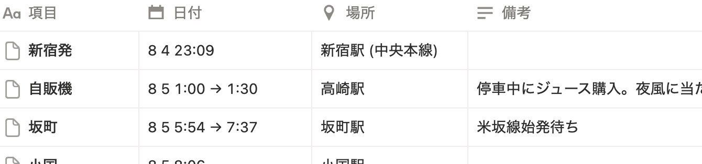
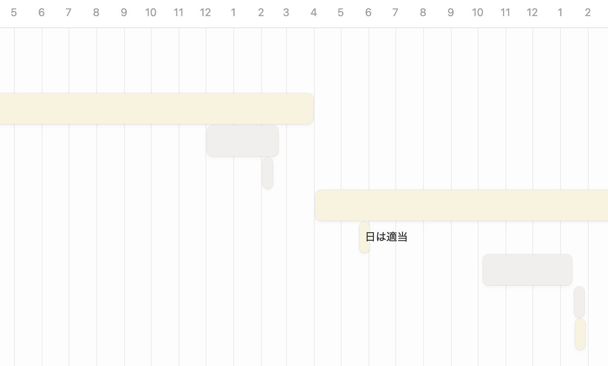
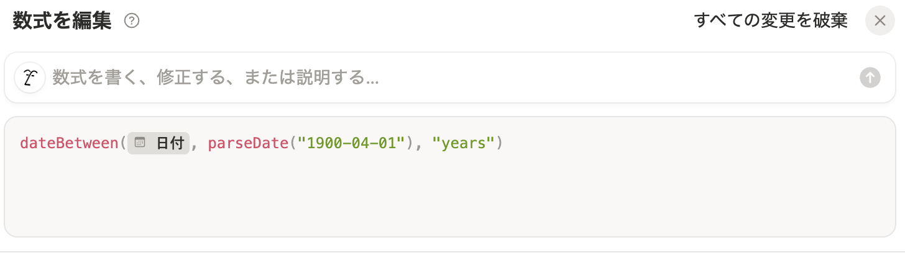
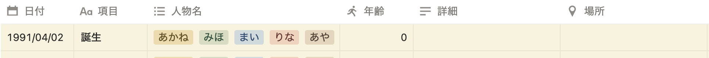
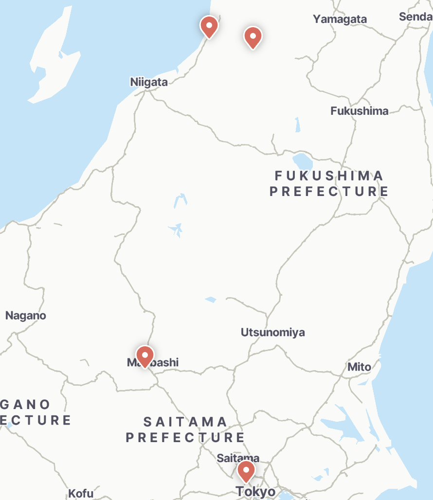

+++
date = '2025-10-23T10:00:00+09:00'
lastmod = '2026-03-08T23:20:00+09:00'
draft = false
title = '時系列を考えて整理する【プロット省略で時短化】'
description = "複雑な物語を破綻させないための時系列整理術。スプレッドシートやカレンダーを活用し、伏線の回収や矛盾の回避を論理的に行う方法を解説します。壮大な世界観や長い時間軸を管理するコツを公開。"
showAuthor = true
+++

このブログのコンセプト的に、記事読んでる方にも会社員しながら執筆やってる方は多いのではないかと思うんですが、私は時系列設定こそ会社員パワーの出しどころだと思ってます。  
だって、登場人物がいつ何をして、何が起こって…って、まるっきりプロジェクト管理じゃないですか。  
というわけで、物語の時系列にはプロジェクト管理ツールが最適だという話と、その末にプロットを書かなくなったところまでを説明していきます。
<!--more-->
## 時系列設定にNotionを選ぶ理由と整理術

時系列の設定に関してだけ言えばAsanaでもTrelloでも好きなプロジェクト管理ツール使っていいんですが、私はアイデア段階から執筆まで一貫させたいのでNotionを使っています。どうやってNotionを使い倒してるかについては以前語っているのでそちらをご覧ください。  


Notionで時系列設定やるメリットは他にもあって、位置情報がわかりやすく紐付けられるのは他にはあまり見ない機能ではないかと思います。ただ、位置情報については実在する場所しか使えないのでファンタジー等には関係ないですが。  
執筆にまつわるいろんな作業を集約するという意味でGoogleに頼ってた時期も長かったんですが、その頃私が時系列設定に使っていたGoogleカレンダーは不便というわけでもなかったです。ただ、Notion等のプロジェクト管理ツールには負ける感じ。だってGoogleカレンダーでやってたことはNotionでもカバーできるので。

### まずはデータベースを作る

最初はテーブルビューが操作しやすいです。私は下記の通り６項目を設定することが多いです。

| (プロパティ名) | 日付 | 項目 | 人物名 | 年齢 | 詳細 | 場所 |
| :---- | :---- | :---- | :---- | :---- | :---- | :---- |
| (プロパティの種類) | 日付 | (初期設定) | マルチセレクト | 数式 | テキスト | 場所 |
| (使い方) | 出来事の日時 | 何の出来事かわかるよう簡単に | 該当する人物を選ぶ | 主人公の年齢 | 備考などメモすることがあれば | 出来事がおこった場所 |

  
日時をざっくりにするか、時間まで細かくするかは物語で扱う流れによってまちまちです。

### タイムラインビュー中心に複数ビューを使う

資料としてざっと確認するにはタイムラインビューが便利です。該当の時期に何があったかを可視化できます。日付順に並べ替えをしておくと、時系列順に並んで確認しやすくなります。表示範囲は分刻みで確認できる最小の時間ビューから、長期間向けの５年ビューまであります。フィルタをかけることもでき、人物ごとに時系列を確認できるのも便利です。  
タイムラインビューをさらに見やすくするため、ビューの設定から「条件付きカラー」を選択し、バーに色が付くようにしておくと良いです。おすすめの設定は人物名で条件を設定し、人物ごとで色を分ける設定です。  
  
時系列の矛盾も可視化されます。物語全体の流れは、仕事で言うところのプロジェクトの工程管理に近いです。

### 登場人物の当時の年齢を表示させるには

数年にわたって展開されるような話では、出来事があったときの人物(主人公など)の年齢を資料としてパッと見たいこと、ありませんか？私はこういうの表計算ソフトじゃないとできないと思ってて、それが今までスプレッドシートを愛用してた理由のひとつでした。表計算ソフトのように手軽ではないですが、Notionでも関数が扱えます。  
プロパティを追加→種類「数式」→プロパティを編集→数式を編集  
dateBetween(prop("**日付**"), parseDate("**1900-04-01**"), "years")  
※「日付」は設定した日時のプロパティ名に変更、「1900-04-01」は当該人物の生年月日に変更してください。  

  
一度設定するだけで、項目を増やしても出来事の日付によって自動で表示してくれるのでめちゃくちゃ便利です。

### ついでに場所も設定しておく

物語において、時間と場所が相関関係になることが多いのは私だけではないと思います。先述した通り、地球上で起こってること限定なんですが、Notionのデータベースでは具体的な場所の指定ができ、地図に表示することができます。  
例えば、下の画像のように、移動を伴う物語の時系列設定の場合です。  
  
まず、鉄道を扱うときはリアルな時刻表通りに行きたいので分刻みです。場所設定も活きてきます。「地図ビュー」を使うことでこのデータベースが下図のように地図表示にもできるのがNotionのすごさ。  

移動など物理的なことの整合性を確認するのに便利なのはもちろんなんですが、具体的な場所や動きが見えることで物語の動きが感覚としてわかりやすくなるため、執筆が捗ります。  
また、地図ビューから直接場所を指定し、そこに日付などの情報を足していくことも可能です。  
タイムラインビューの説明で紹介した「条件付きカラー」は地図ビューにも適用でき、ピンの色を変更できます。人物によってピンの色を設定しておくとわかりやすく、さらにフィルタ機能で日付の絞り込みをすれば、同時刻に誰がどこにいるのかが一目瞭然になります。

## 時系列設定をプロット代わりに

プロット書きたい人とか、詳細な構成案を作成するようなスタイルの方は時系列設定した上で別途プロットも書くで全然いいんですが、私みたいに会社勤めであって執筆時間あんまり取れないだとか、そういう人はプロットなしの方向に切り替えてしまっていいと思います。ここまでかっちりと時の流れを設定して整理してあるんだしプロットなくても全然なんとかなります。  
むしろ、時系列って物語で起こる事実が必要以上にめちゃくちゃ網羅されてるんで、物語の流れはここにあって、すでにプロットの役割をわりと担ってるんですよね。  
まだ他にも必要な情報があれば、「感情」とかをプロパティ追加したりで加える形をとってしまえばいいだけです。これだけでプロットを書く時間を大幅に短縮できます。  
私自身は、もうそのあたりは執筆中の手に任せてもいいと判断しています。むしろ、執筆前にガチガチに固めると手が動かなくなってしまうし(私の場合)、事実の羅列である時系列が土台にあることによって、プロットがないからと話がブレてしまうとかも特にありません。

## 会社員アイテムを執筆にも使おう

時系列設定をNotionで行うメリットを整理します。

* **プロジェクト管理と同じ感覚で書ける**: 登場人物の動きをタスクのように可視化できる。  
* **計算や位置情報の自動化**: 生年月日からの年齢算出やマップ表示など、手作業の矛盾を排除できる。  
* **プロット作成の時間をカット**: 緻密な時系列設定そのものが、すでにプロットの役割を果たす。

多くの人が抱える「書く時間がない」という課題に対し、私はどうやって作業時間を短縮できるかという視点を持ってプロジェクト管理ツールを導入しました。仕事ではいかに効率的に動くかということが重視されがちですが、執筆活動でも同じように効率化を意識できれば少ない時間の中でも小説の完結を目指せるはずです。
